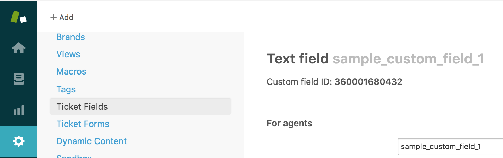

:warning: *Use of this software is subject to important terms and conditions as set forth in the License file* :warning:

# Zendesk Sample Apps for iOS. Support SDK V2
The enclosing repository consists of a group of iOS sample applications that will help you learn how to use the Zendesk Apps framework and APIs.

We hope you'll find those sample Apps useful and encourage you to re-use some of this code in your own Apps.

## Documentation

### Getting started
Getting started is fairly straightforward. 
Simply download or clone the repository to your system.
Open the directory in terminal.
Ensure the Pod is up-to-date by running `pod update`.
Install the pods by running  `pod install`.
Open up the project in Xcode, and there are three apps ready to run in your environment.

Make sure you initialize your Zendesk instance in the App Delegate, before running that application.

#### Custom Fields Sample
The custom fields sample app demonstrates the Custom Fields feature of the Zendesk SDK.
This application assumes you have one or more instances of a custom field set up in your Zendesk Support instance.
From your Support account retrieve the custom field ID:

Then simply paste the ID into the ViewController:
```swift
let customFieldID: NSNumber // Your customFieldID
if let textField1 = customField1.text, !textField1.isEmpty {
    list.append(ZDKCustomField(fieldId: customFieldID, andValue: textField1))
}
...
```
If a value is then supplied to that field on request sent, then there will be a value in the corresponding custom field for that ticket, in Zendesk Support.
#### Request Updates Sample
The Request Updates sample app demonstrates the Request Updates features of the Zendesk SDK.

To see how it works:
- Create a ticket in the Request List View. Leave the ticket.
- Reply to the ticket in your Zendesk Support account.
- Stay in the Request List View and refresh the page.
- Leave the Request List View to the main view.
- Press the Request Updates button. The UI should update with a notification of the update.

The reason we have to refresh the Request List view is because the ZDKRequestUpdates are cached for up to one hour.
The method `getUpdatesForDevice` must be called again to retrieve the updates from the request provider.

#### Upload Attachment Sample
The Upload Attachment sample app implements the ability to send a request to a Zendesk agent, with an image attachment alongside it.

The app uses the following features of the Zendesk Support SDK:
- ZDKCreateRequest
  - The request object that is sent to the agent, derived from the different user-entry fields of the app.
- ZDKUploadProvider
    - Interface for providing images to Zendesk.
    - Contains the `uploadAttachment` method that returns the ZDKUploadResponse object that contains the attachment.
- ZDKRequestProvider
    - Interface for providing requests to the provider.
    - Used to send ZDKCreateRequest objects to the Zendesk instance linked to the app.
- ZDKToast
    - Displays information to the user when something has happened. e.g. request sent, request not sent.

At minimum, fill out the required fields of the app, and press send, this will create a ticket.
## Bugs
Please submit bug reports to [Zendesk](https://support.zendesk.com/requests/new).
